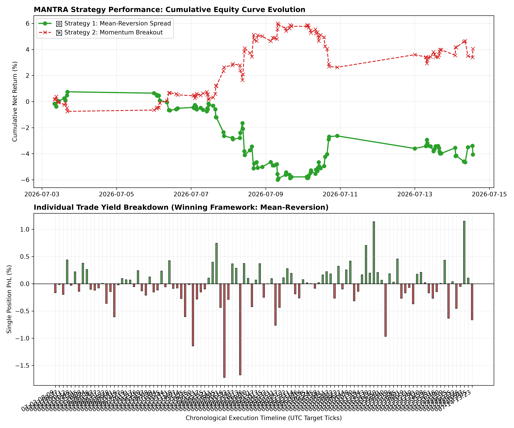

# 📊 MANTRA Quantitative Pilot Simulation
    
This automated research node evaluates the directionality of asset prices immediately following a detected rolling anomaly cluster.
    
### 🔬 Pilot Parameters
* **Captured Anomaly Signals (Post-Cooldown):** 107
* **Position Holding Horizon:** 15 Minutes
* **Data Scale Basis:** Standard Closing Mid-Prices (Proof of Concept)

### 📦 Asset Class Exposure (What was traded?)
* **🇺🇸 US500 (S&P 500 Index):** 5 trades executed
* **👑 GOLD Spot:** 21 trades executed
* **🛢️ OIL_CRUDE Spot:** 81 trades executed
    
### 📈 Directional Leaderboard
| Directional Strategy | Total Simulated PnL (%) | Baseline Status |
| :--- | :--- | :--- |
| **🔄 Strategy 1: Mean-Reversion Spread** | -4.0558% | 🔴 Negative Horizon |
| **🚀 Strategy 2: Momentum Breakout** | +4.0558% | 🟢 Positive Horizon |
    
### 🏁 Research Verdict
> **MARKET CHARACTERISTIC:** Following an isolation shock, the asset pricing registry historically favors the **Momentum Breakout** framework (Gross Return: +4.056%). *Note: This baseline pilot model excludes transactional spreads and execution slippage.*

---

### 📉 Visual Backtest Audit Ledger
Below is the verified performance data logging the equity path and structural distribution of the individual position yields.

